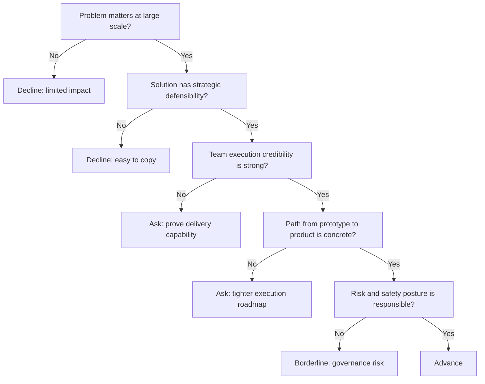

---
tags:
  - hackathon-judge
  - final-round
judge_round: final_round
last_researched: '2026-02-05'
research_confidence: high
last_verified: '2026-02-05'
verification_basis: public-signals-only
---
# Greg Brockman

## Snapshot
- Current role: President and Co-founder of OpenAI.
- Public scope: company strategy, product direction, and frontier model deployment.
- Historical context: long-term leadership in OpenAI’s technical and organizational trajectory.

## Judging Lens (Likely)
- Strategic importance and long-term defensibility of what you are building.
- Execution quality: ability to deliver under ambiguity and complexity.
- Potential for outsized real-world impact with advanced AI capabilities.

## Practical Pitch Strategy
- Lead with vision + concrete traction (why this matters now and at scale).
- Show a clear path from prototype to durable product/company.
- Be concise about execution plan, risks, and differentiated capability.

## Source Links
- https://openai.com/index/sharing-the-safety-systems-behind-gpt-4/
- https://openai.com/index/openai-podcast-episode-6-with-greg-brockman-and-tibo-sottiaux/

## Confidence
High (first-party OpenAI sources and long-standing public leadership profile).

## Decision Tree (Mermaid)

