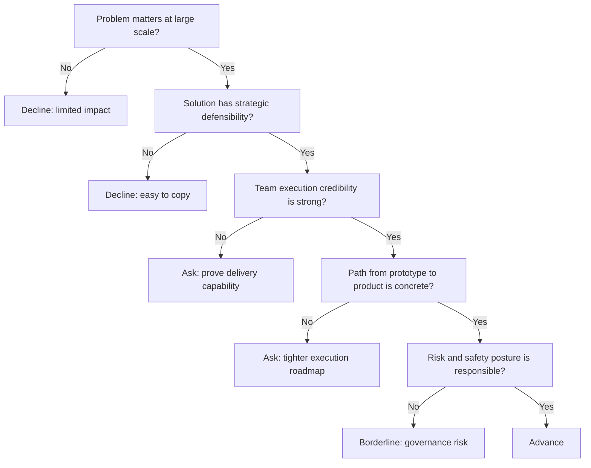

---
tags:
  - hackathon-judge
  - final-round
judge_round: final_round
last_researched: '2026-02-05'
last_verified: '2026-02-05'
verification_basis: cited-public-sources
research_confidence: high
identity_risk: low
---
# Greg Brockman

## Verified Facts (Cited)
- OpenAI's leadership update names Greg Brockman as President and Co-founder of OpenAI. [S1]
- OpenAI's Broadcom collaboration announcement quotes him as "OpenAI co-founder and President Greg Brockman." [S2]
- OpenAI's DevDay 2025 announcement lists Greg Brockman (President) among featured speakers. [S3]

## Inferred Judging Lens (Inference)
- Likely to focus on strategic importance, execution strength, and long-term product/company durability. [S1][S2][S3]
- Likely to value clear paths from prototype to scaled, reliable product impact. [S2][S3]

## Pitch Guidance
- Lead with high-impact problem framing and durable strategic wedge.
- Show credible scale plan, execution milestones, and key risks.
- Keep claims concise and evidence-backed.

## Sources (Resolved 2026-02-05)
- [S1] https://openai.com/blog/leadership-team-update/
- [S2] https://openai.com/index/openai-and-broadcom-announce-strategic-collaboration/
- [S3] https://openai.com/blog/announcing-devday-2025/

## Confidence
High. Multiple first-party sources consistently identify role and scope.

## Decision Tree (Mermaid)

