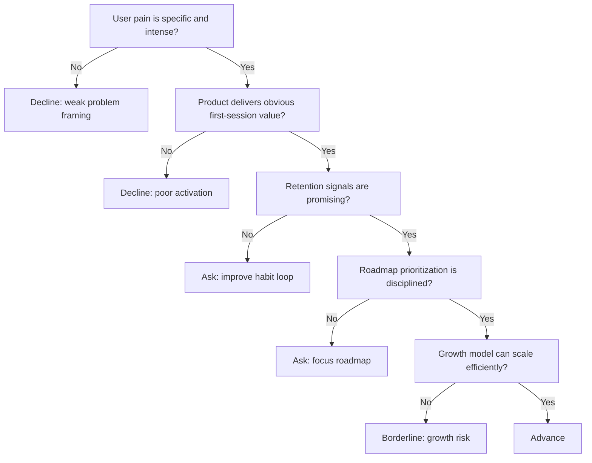

---
tags:
  - hackathon-judge
  - final-round
judge_round: final_round
last_researched: '2026-02-05'
research_confidence: high
last_verified: '2026-02-05'
verification_basis: public-signals-only
---
# Lenny Rachitsky

## Snapshot
- Current role: Author of Lenny’s Newsletter and host of a product-focused podcast.
- Prior background: product leadership/operator path (publicly associated with Airbnb-era product work).
- Focus: practical product strategy, growth, and execution for builders.

## Judging Lens (Likely)
- User-value clarity and product insight depth.
- Product strategy rigor: ICP, onboarding, retention loop, expansion path.
- Team execution quality and prioritization under constraints.

## Practical Pitch Strategy
- Tell a crisp user story with measurable behavior change.
- Show retention or repeat usage evidence, not only interest.
- Demonstrate a tight product roadmap with explicit tradeoffs.

## Source Links
- https://www.lennysnewsletter.com/
- https://www.lennyrachitsky.com/about

## Confidence
High (first-party site with consistent long-running public product profile).

## Decision Tree (Mermaid)

