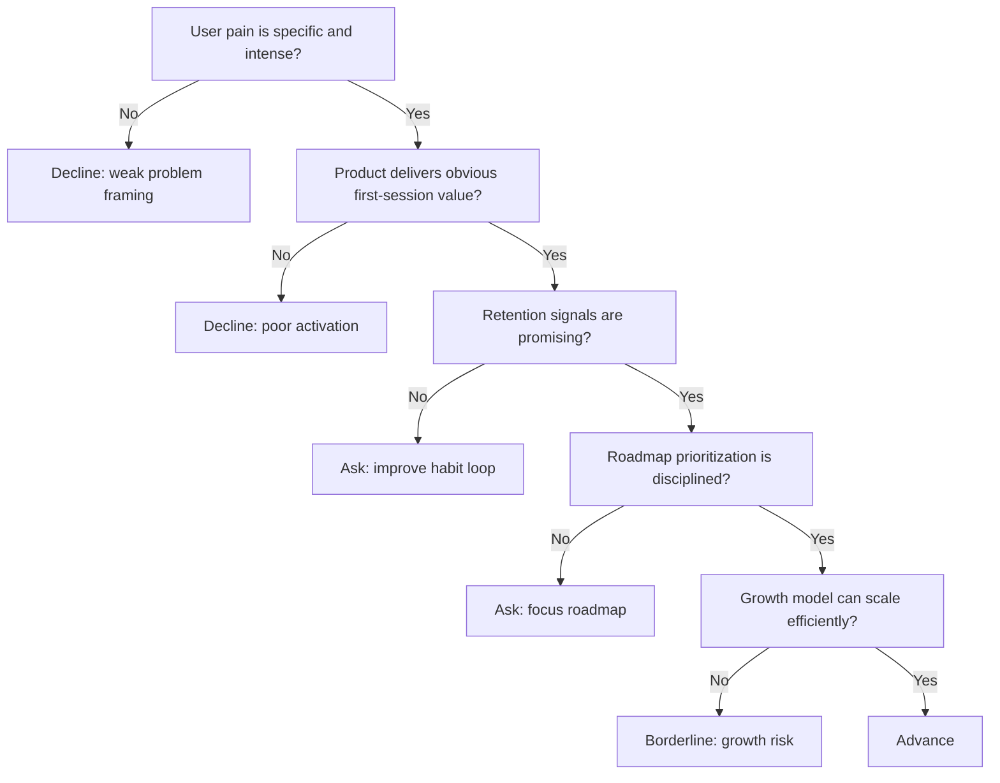

---
tags:
  - hackathon-judge
  - final-round
judge_round: final_round
last_researched: '2026-02-05'
last_verified: '2026-02-05'
verification_basis: cited-public-sources
research_confidence: high
identity_risk: low
---
# Lenny Rachitsky

## Verified Facts (Cited)
- Lenny Rachitsky's official site describes him as creator of Lenny's Newsletter and host of Lenny's Podcast. [S1]
- Lenny's Newsletter about page presents the publication's focus on product, growth, and startup operator learning. [S2]

## Inferred Judging Lens (Inference)
- Likely to prioritize user-value clarity, product strategy rigor, and retention/behavioral evidence. [S1][S2]
- Likely to reward disciplined prioritization and practical execution under constraints. [S2]

## Pitch Guidance
- Show measurable behavior change, not just top-of-funnel excitement.
- Make the activation and retention loop explicit.
- Present roadmap tradeoffs clearly.

## Sources (Resolved 2026-02-05)
- [S1] https://www.lennyrachitsky.com/
- [S2] https://www.lennysnewsletter.com/about

## Confidence
High. First-party profile and publication scope are clear.

## Decision Tree (Mermaid)

