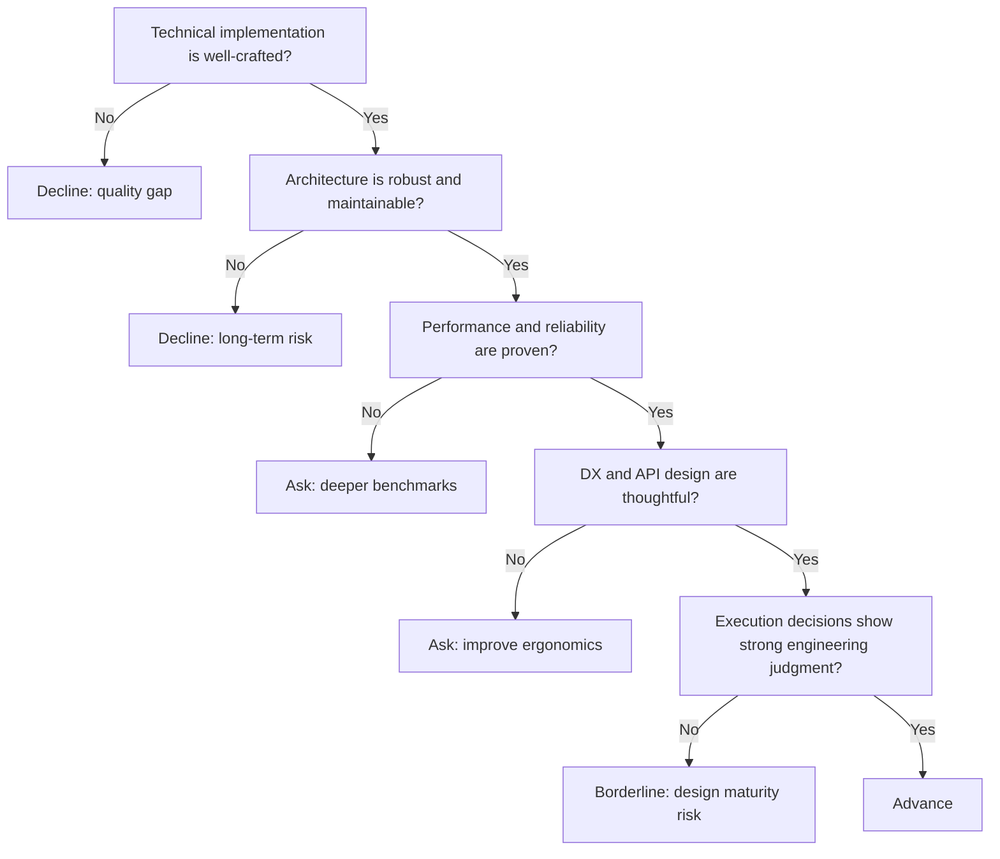

---
tags:
  - hackathon-judge
  - final-round
judge_round: final_round
last_researched: '2026-02-05'
last_verified: '2026-02-05'
verification_basis: cited-public-sources
research_confidence: high
identity_risk: low
---
# Peter Steinberger

## Verified Facts (Cited)
- Peter Steinberger's site (steipete.me) identifies his public engineering profile and long-form technical writing. [S1]
- His GitHub profile identifies him as a software engineer and "ex-PSPDFKit founder." [S2]
- Nutrient's company history describes PSPDFKit's founding timeline and later rebrand context. [S3]

## Inferred Judging Lens (Inference)
- Likely to prioritize implementation quality, system robustness, and maintainable architecture. [S1][S2]
- Likely to value evidence of engineering craftsmanship over high-level positioning alone. [S1]

## Pitch Guidance
- Lead with implementation decisions and why they improve reliability.
- Include maintainability/performance evidence from real usage.
- Keep API and developer experience choices concrete.

## Sources (Resolved 2026-02-05)
- [S1] https://steipete.me/
- [S2] https://github.com/steipete
- [S3] https://www.nutrient.io/company/about/pspdfkit/

## Confidence
High. Identity and technical background are strongly corroborated.

## Decision Tree (Mermaid)

