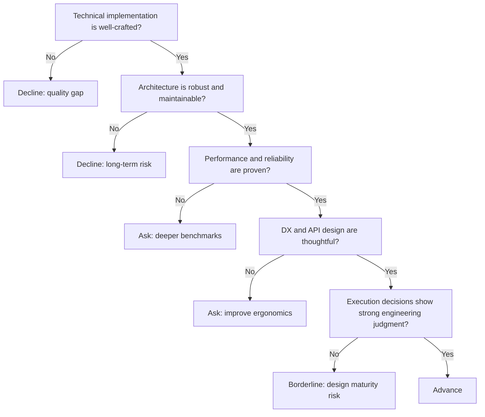

---
tags:
  - hackathon-judge
  - final-round
judge_round: final_round
last_researched: '2026-02-05'
research_confidence: high
last_verified: '2026-02-05'
verification_basis: public-signals-only
---
# Peter Steinberger

## Snapshot
- Public profile: long-time software engineer/entrepreneur ("steipete").
- Notable work: created PSPDFKit (later Nutrient SDK) and active engineering writing/open-source contributions.
- Current focus: deep technical product building, software quality, and tooling.

## Judging Lens (Likely)
- Engineering craftsmanship and system quality.
- Architectural choices that hold up under scale and maintenance.
- Product decisions grounded in strong technical fundamentals.

## Practical Pitch Strategy
- Show code and architecture quality, not only high-level concept.
- Explain why your implementation choices improve reliability and speed.
- Demonstrate evidence of real-world maintainability and developer trust.

## Source Links
- https://steipete.me/
- https://www.nutrient.io/company/news/five-things-you-did-not-know-about-pspdfkit/
- https://github.com/steipete

## Confidence
High (first-party identity plus company history corroboration).

## Decision Tree (Mermaid)

