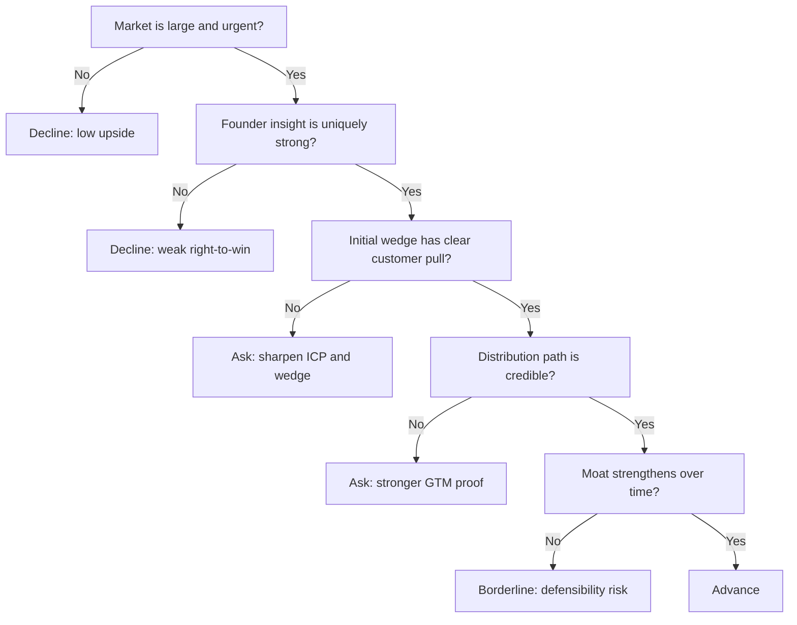

---
tags:
  - hackathon-judge
  - final-round
judge_round: final_round
last_researched: '2026-02-05'
last_verified: '2026-02-05'
verification_basis: cited-public-sources
research_confidence: high
identity_risk: low
---
# Sonya Huang

## Verified Facts (Cited)
- Sequoia Capital's official people page identifies Sonya Huang as a Partner. [S1]
- Sequoia portfolio pages list Sonya Huang as partner contact on AI companies (for example, Gong and Fireworks AI). [S2][S3]

## Inferred Judging Lens (Inference)
- Likely to assess market size, wedge quality, distribution leverage, and moat durability. [S1][S2][S3]
- Likely to prioritize founder insight depth and strategic timing. [S1]

## Pitch Guidance
- Explain initial wedge and why incumbents cannot copy quickly.
- Show evidence of customer pull and expansion logic.
- Be explicit about defensibility over time.

## Sources (Resolved 2026-02-05)
- [S1] https://sequoiacap.com/people/sonya-huang/
- [S2] https://sequoiacap.com/companies/gong/
- [S3] https://sequoiacap.com/companies/fireworks-ai/

## Confidence
High. First-party investor profile and portfolio context are clear.

## Decision Tree (Mermaid)

