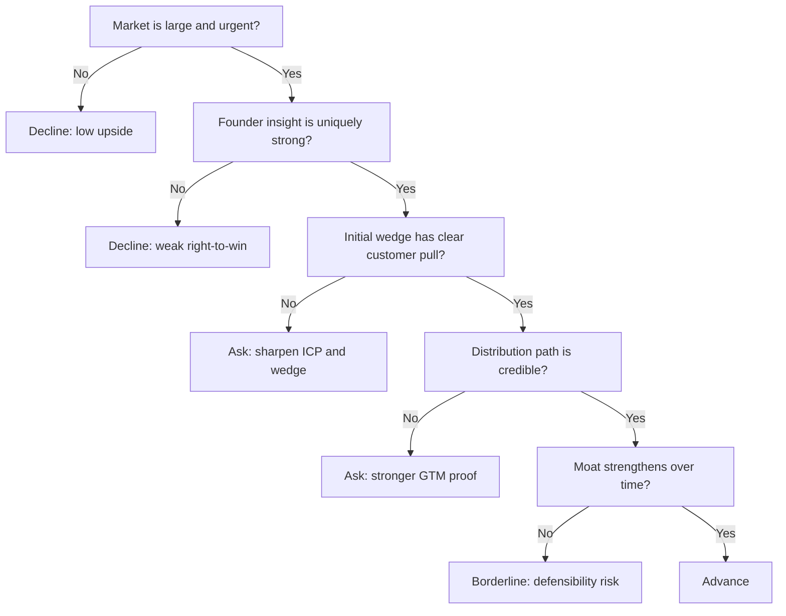

---
tags:
  - hackathon-judge
  - final-round
judge_round: final_round
last_researched: '2026-02-05'
research_confidence: high
last_verified: '2026-02-05'
verification_basis: public-signals-only
---
# Sonya Huang

## Snapshot
- Current role: Partner at Sequoia Capital.
- Focus area: AI investing and company-building in application and platform layers.
- Public footprint: frequent writing/speaking on AI market shifts and founder execution.

## Judging Lens (Likely)
- Market size and strategic timing.
- Team-market fit and founder insight depth.
- Defensibility: distribution, data advantage, workflow lock-in, and execution speed.

## Practical Pitch Strategy
- Explain the wedge clearly: where you win first and why incumbents cannot copy quickly.
- Prove urgency with user behavior and measurable pull.
- Show a credible expansion path beyond your initial use case.

## Source Links
- https://www.sequoiacap.com/people/sonya-huang/
- https://www.forbes.com/sites/kenrickcai/2023/04/17/sequoia-sonya-huang-generative-ai-hot-list/

## Confidence
High (strong first-party investor profile plus broad secondary coverage).

## Decision Tree (Mermaid)

