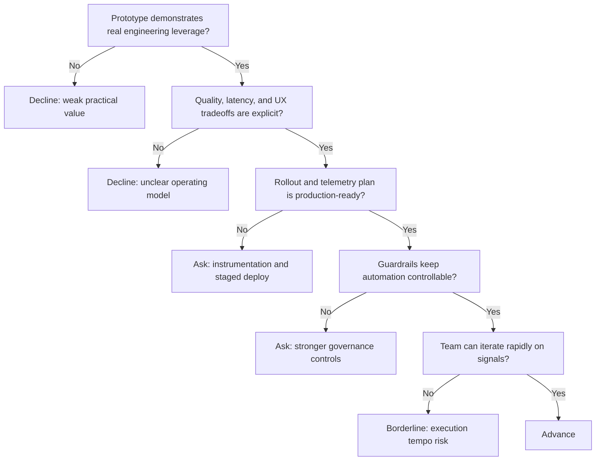

---
tags:
  - hackathon-judge
  - final-round
judge_round: final_round
last_researched: '2026-02-05'
last_verified: '2026-02-05'
verification_basis: cited-public-sources
research_confidence: high
identity_risk: low
---
# Tibo Sottiaux

## Verified Facts (Cited)
- OpenAI Podcast episode 6 on Acast identifies Tibo Sottiaux as Codex engineering lead. [S1]
- Software Engineering Daily episode coverage identifies Tibo Sottiaux and Ed Bayes discussing OpenAI and Codex. [S2]
- OpenAI's official podcast post confirms the episode with Greg Brockman and Tibo Sottiaux focused on the future of coding with AI. [S3]

## Inferred Judging Lens (Inference)
- Likely to prioritize productized agent systems that balance quality, latency, reliability, and rollout safety. [S1][S2][S3]
- Likely to reward teams with strong telemetry, guardrails, and iterative deployment discipline. [S1][S2]

## Pitch Guidance
- Show operational tradeoffs and why they are defensible.
- Provide evidence of stability in production-like conditions.
- Demonstrate monitoring, gating, and feedback loops.

## Sources (Resolved 2026-02-05)
- [S1] https://shows.acast.com/openai-podcast/episodes/episode-6-the-future-of-coding-with-ai
- [S2] https://softwareengineeringdaily.com/2026/01/29/openai-and-codex-with-thibault-sottiaux-and-ed-bayes/
- [S3] https://openai.com/index/openai-podcast-episode-6-with-greg-brockman-and-tibo-sottiaux/

## Confidence
High. Role and domain focus are consistently supported by direct episode sources.

## Decision Tree (Mermaid)

