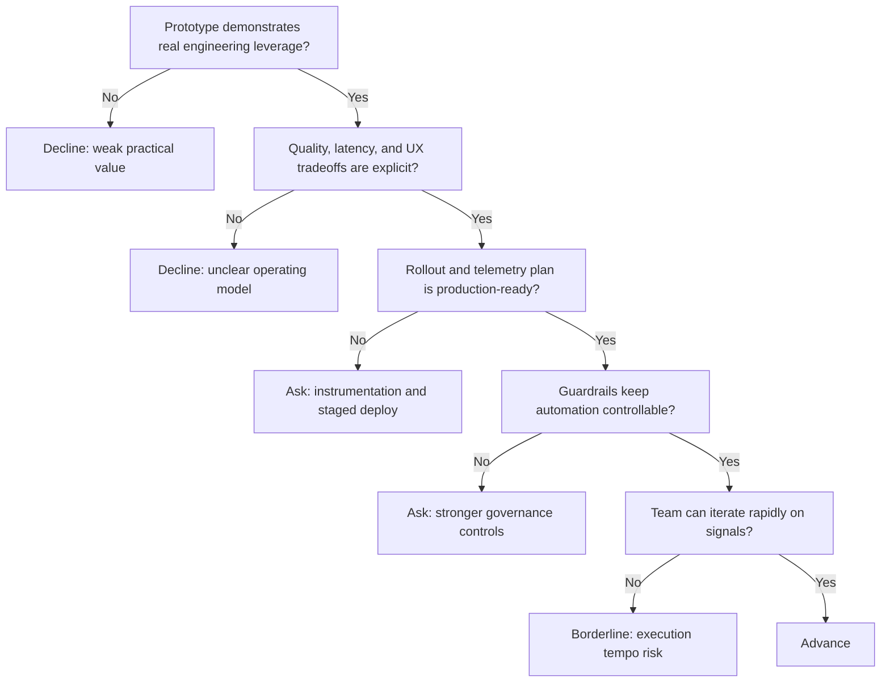

---
tags:
  - hackathon-judge
  - final-round
judge_round: final_round
last_researched: '2026-02-05'
research_confidence: high
identity_risk: low
last_verified: '2026-02-05'
verification_basis: public-signals-only
---
# Tibo Sottiaux

## Verified Public Signals (as of February 5, 2026)
- Official OpenAI podcast episode features Greg Brockman and Tibo Sottiaux discussing Codex.
- Acast metadata for that episode identifies Tibo as Codex engineering lead.
- Additional engineering podcast coverage similarly frames Tibo as leading OpenAI Codex engineering.

## Inferred Judging Priorities
Inference from those sources:
- End-to-end productization of coding agents at scale.
- Engineering tradeoffs across model quality, latency, reliability, and UX.
- Practical rollout discipline (guardrails, telemetry, iterative deployment).

## What To Emphasize In Your Pitch
- How your system moves from impressive prototype to dependable product.
- Clear tradeoff decisions and why they are operationally sound.
- Evidence of stability and learning loops in real usage.

## What To Avoid
- Abstract strategy without operating evidence.
- Ignoring rollout and monitoring details.
- Over-automation with weak control surfaces.

## Likely Questions To Prepare For
- "How does this hold up in production-like usage?"
- "What tradeoffs did you make and why?"
- "How does your team monitor, evaluate, and iterate safely?"

## Source Links
- https://openai.com/index/openai-podcast-episode-6-with-greg-brockman-and-tibo-sottiaux/
- https://openai.simplecast.com/episodes/openai-podcast-episode-6-with-greg-brockman-and-tibo-sottiaux
- https://shows.acast.com/openai-podcast/episodes/openai-podcast-episode-6-with-greg-brockman-and-tibo-sottia
- https://softwareengineeringdaily.com/2025/11/18/openai-codex-for-agentic-software-engineering-with-tibo-sottiaux-and-ed-bayes/

## Confidence + Identity Risk
High confidence, low identity risk based on multiple direct episode-level sources.

## Decision Tree (Mermaid)

