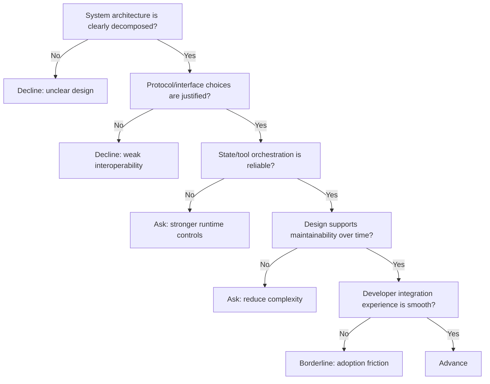

---
tags:
  - hackathon-judge
  - first-round
judge_round: first_round
last_researched: '2026-02-05'
research_confidence: high
last_verified: '2026-02-05'
verification_basis: public-signals-only
---
# Celia Chen

## Snapshot
- Current signal: Engineering author at OpenAI on Codex platform internals (App Server/harness).
- Focus area: Agent runtime design, protocol/interface choices, and developer integration surfaces.
- Evidence strength: first-party OpenAI publication bylined to Celia Chen.

## Judging Lens (Likely)
- Quality of system architecture for agentic workflows.
- API/protocol design choices and integration ergonomics.
- Reliability and maintainability in multi-surface tooling (CLI/IDE/web).

## Practical Pitch Strategy
- Show a clear architecture diagram in words: orchestrator, tools, state, and safety boundaries.
- Explain why your protocol choices improve interoperability and debuggability.
- Emphasize long-term maintainability, not just prototype speed.

## Source Links
- https://openai.com/index/unlocking-the-codex-harness/
- https://openai.com/business/guides-and-resources/how-openai-uses-codex/

## Confidence
High (first-party OpenAI byline and codex-focused technical publication).

## Decision Tree (Mermaid)

