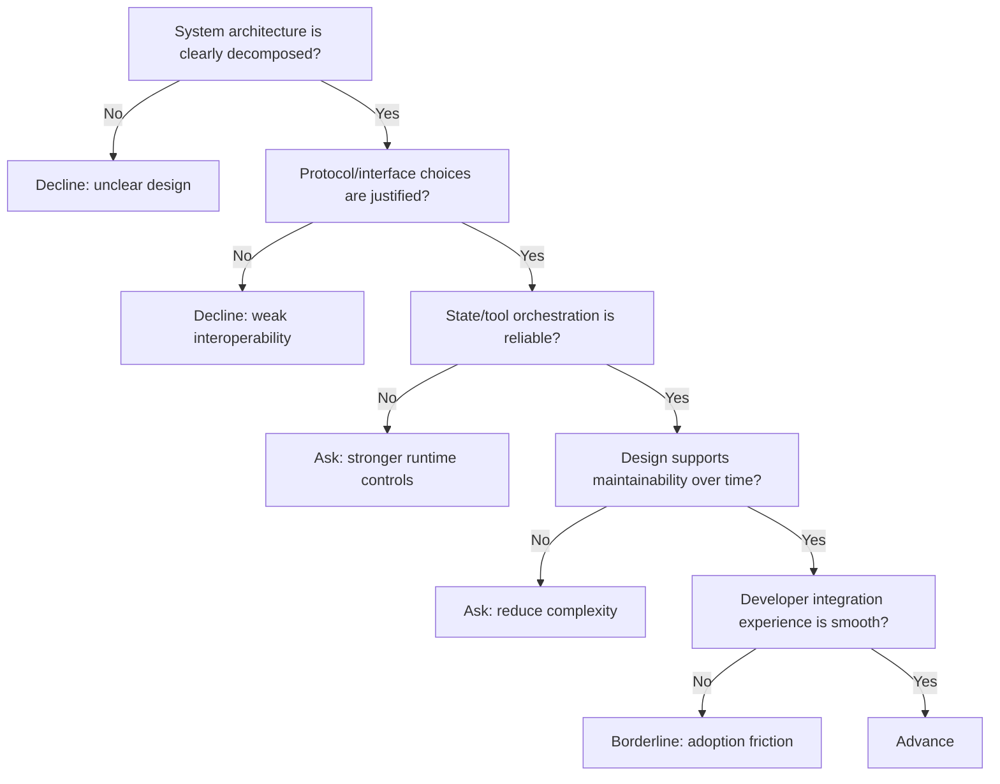

---
tags:
  - hackathon-judge
  - first-round
judge_round: first_round
last_researched: '2026-02-05'
last_verified: '2026-02-05'
verification_basis: cited-public-sources
research_confidence: high
identity_risk: low
---
# Celia Chen

## Verified Facts (Cited)
- OpenAI published "Unlocking the Codex harness: how we built the App Server" and lists Celia Chen as author and Member of the Technical Staff. [S1]
- That write-up details Codex App Server architecture (JSON-RPC, thread lifecycle, tool execution, and client integration), which is core to Codex runtime design. [S1]
- OpenAI's engineering guide describes Codex usage across internal engineering teams and emphasizes reliability, workflow structure, and engineering quality. [S2]

## Inferred Judging Lens (Inference)
- Likely to value architecture clarity, protocol/tooling decisions, and maintainable agent runtime design. [S1][S2]
- Likely to reward teams that can explain state, orchestration, and safety boundaries with concrete implementation details. [S1]

## Pitch Guidance
- Show a clear system diagram in words: orchestrator, tools, thread/state model, and guardrails.
- Explain why your interface/protocol choices reduce operational ambiguity.
- Demonstrate maintainability choices, not just demo speed.

## Sources (Resolved 2026-02-05)
- [S1] https://openai.com/index/unlocking-the-codex-harness/
- [S2] https://openai.com/business/guides-and-resources/how-openai-uses-codex/

## Confidence
High. Evidence is first-party and directly role-relevant.

## Decision Tree (Mermaid)

