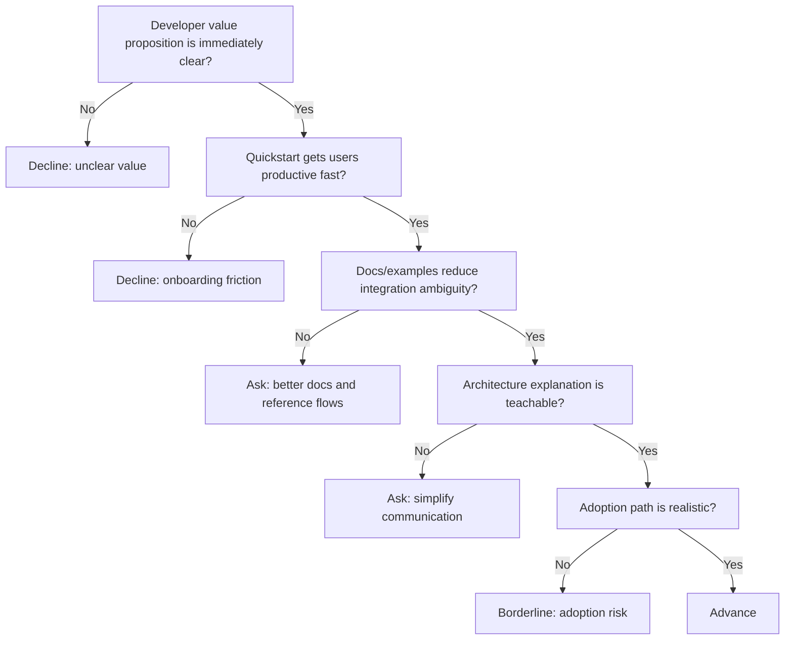

---
tags:
  - hackathon-judge
  - first-round
judge_round: first_round
last_researched: '2026-02-05'
research_confidence: high
last_verified: '2026-02-05'
verification_basis: public-signals-only
---
# Charlie Guo

## Snapshot
- Current role: Developer Experience at OpenAI.
- Public work: Author of the "Artificial Ignorance" newsletter; writes technical content for builders.
- Focus area: Documentation, guides, tutorials, and practical AI-builder enablement.

## Judging Lens (Likely)
- Clarity and teachability of your product for developers.
- Documentation quality, onboarding flow, and practical adoption friction.
- How quickly an external developer can get meaningful outcomes.

## Practical Pitch Strategy
- Pair your demo with a concise "quickstart" narrative.
- Make architecture decisions legible to outside builders.
- Highlight how your tool shortens time-to-productivity for real dev teams.

## Source Links
- https://www.ignorance.ai/p/on-joining-openai
- https://muckrack.com/charlie-guo

## Confidence
High (first-person statement of OpenAI role and consistent external profile corroboration).

## Decision Tree (Mermaid)

