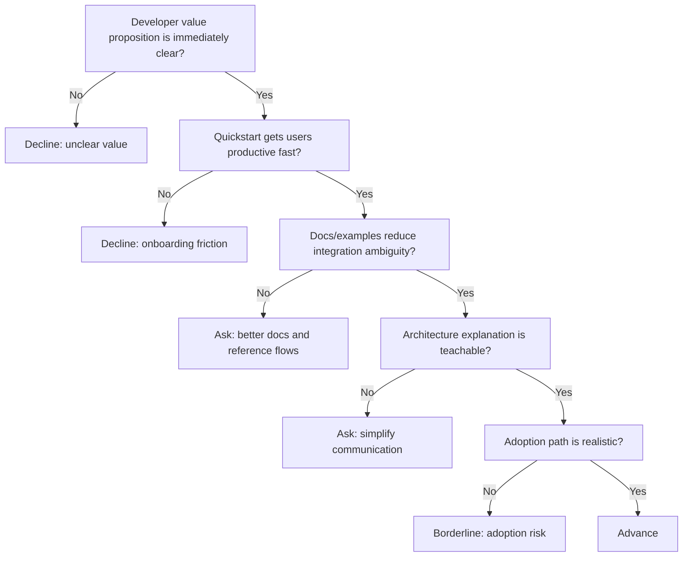

---
tags:
  - hackathon-judge
  - first-round
judge_round: first_round
last_researched: '2026-02-05'
last_verified: '2026-02-05'
verification_basis: cited-public-sources
research_confidence: high
identity_risk: low
---
# Charlie Guo

## Verified Facts (Cited)
- In "On Joining OpenAI," Charlie Guo states he joined OpenAI's Developer Experience team and describes work on docs, guides, tutorials, and developer enablement. [S1]
- Muck Rack profile metadata aligns with this positioning and lists "Developer Experience @OpenAI" and "Author of Artificial Ignorance." [S2]

## Inferred Judging Lens (Inference)
- Likely to prioritize product teachability, onboarding clarity, and developer adoption friction. [S1][S2]
- Likely to value clear quickstart narratives and practical documentation quality. [S1]

## Pitch Guidance
- Lead with fast time-to-first-value for developers.
- Show onboarding in steps that a new external builder can follow.
- Keep architecture explanation concise and implementation-oriented.

## Sources (Resolved 2026-02-05)
- [S1] https://www.ignorance.ai/p/on-joining-openai
- [S2] https://muckrack.com/charlie-guo

## Confidence
High. Primary self-authored source plus consistent public profile corroboration.

## Decision Tree (Mermaid)

