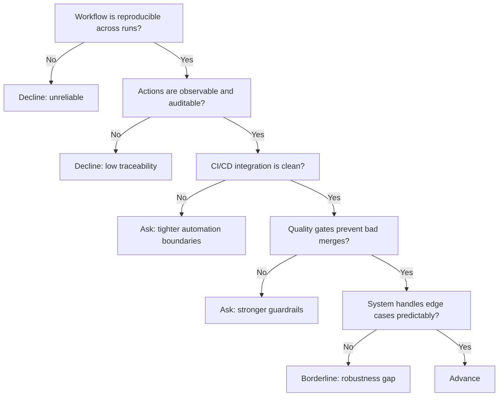

---
tags:
  - hackathon-judge
  - first-round
judge_round: first_round
last_researched: '2026-02-05'
research_confidence: high
identity_risk: low
last_verified: '2026-02-05'
verification_basis: public-signals-only
---
# Charlie Weems

## Verified Public Signals (as of February 5, 2026)
- First-party OpenAI Cookbook entries repeatedly byline Charlie Weems on Codex implementation topics.
- Published topics include CI auto-fix, Codex MCP/Agents SDK workflow design, and Codex SDK code review patterns.
- The content focus is deeply operational: reproducibility, orchestration, traceability, and CI/CD integration.

## Inferred Judging Priorities
Inference from published technical material:
- Repeatable engineering workflows over one-off demos.
- Observable agent behavior and auditable execution trails.
- CI-integrated reliability and disciplined automation.

## What To Emphasize In Your Pitch
- A deterministic workflow story: trigger, scope, execution, validation, merge.
- Instrumentation and evidence (logs, traces, pass/fail criteria, rollback behavior).
- How your system behaves under failures and noisy inputs.

## What To Avoid
- Demo-only prototypes that skip integration into real delivery pipelines.
- Missing eval harness or unclear acceptance criteria.
- Ambiguous ownership between humans and autonomous agents.

## Likely Questions To Prepare For
- "How reproducible are your outputs across runs?"
- "How do you audit what the agent actually did?"
- "How does this fit into CI/CD without introducing fragile automation?"

## Source Links
- https://cookbook.openai.com/examples/codex/codex_mcp_agents_sdk/building_consistent_workflows_codex_cli_agents_sdk
- https://cookbook.openai.com/examples/codex/autofix-github-actions
- https://cookbook.openai.com/examples/codex/build_code_review_with_codex_sdk

## Confidence + Identity Risk
High confidence, low identity risk for Codex-domain expertise based on repeated first-party bylines.

## Decision Tree (Mermaid)

