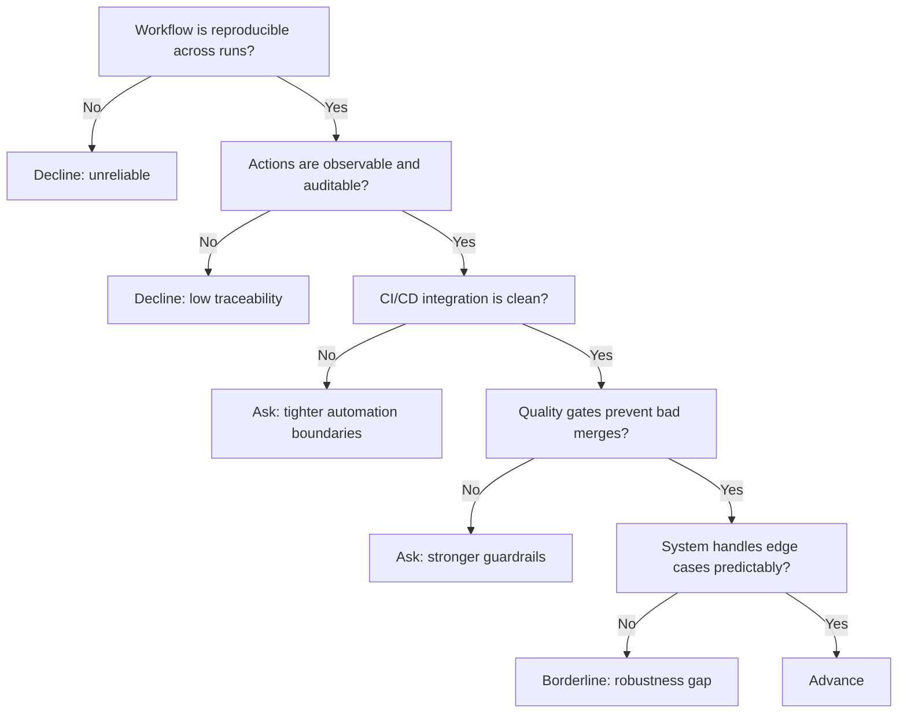

---
tags:
  - hackathon-judge
  - first-round
judge_round: first_round
last_researched: '2026-02-05'
last_verified: '2026-02-05'
verification_basis: cited-public-sources
research_confidence: high
identity_risk: low
---
# Charlie Weems

## Verified Facts (Cited)
- OpenAI Cookbook's "Building Consistent Workflows with Codex CLI & Agents SDK" is authored by Josh Hall and Charlie Weems. [S1]
- The guide emphasizes repeatability, orchestration, and auditability in agent workflows. [S1]
- OpenAI Cookbook includes related Codex operational examples for CI autofix and Codex-driven code review workflows. [S2][S3]

## Inferred Judging Lens (Inference)
- Likely to value reproducible engineering workflows over one-off demos. [S1][S2]
- Likely to emphasize observability, CI integration, and operational controls. [S1][S3]

## Pitch Guidance
- Present deterministic workflow stages (trigger, execution, verification, merge).
- Show traceability artifacts (logs, acceptance checks, failure handling).
- Explain how your workflow integrates with CI/CD safely.

## Sources (Resolved 2026-02-05)
- [S1] https://cookbook.openai.com/examples/codex/codex_mcp_agents_sdk/building_consistent_workflows_codex_cli_agents_sdk
- [S2] https://cookbook.openai.com/examples/codex/autofix-github-actions
- [S3] https://cookbook.openai.com/examples/codex/build_code_review_with_codex_sdk

## Confidence
High. First-party technical material is directly aligned to judging-relevant behavior.

## Decision Tree (Mermaid)

