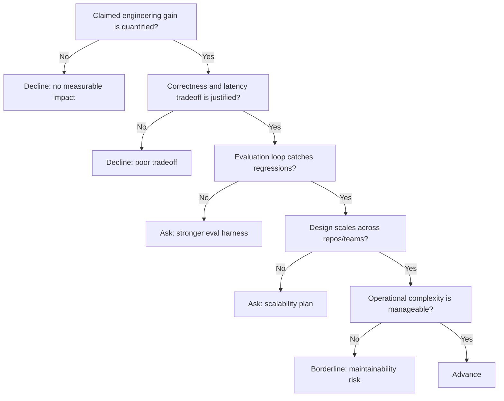

---
tags:
  - hackathon-judge
  - first-round
  - needs-verification
judge_round: first_round
last_researched: '2026-02-05'
last_verified: '2026-02-05'
verification_basis: cited-public-sources
research_confidence: medium
identity_risk: medium
---
# Daniel Steigman

## Verified Facts (Cited)
- Daniel Steigman's Luma profile lists him as "Head of Operations @ Cline." [S1]
- Cline's author page identifies Daniel Steigman (Nighttrek) and includes his writing under Cline channels. [S2]
- The Information reports OpenAI hired at least seven staffers from Cline and specifically references Daniel Steigman as moving to Codex work. [S3]

## Inferred Judging Lens (Inference)
- Likely to prioritize measurable engineering outcomes and pragmatic delivery over broad conceptual framing. [S2][S3]
- Likely to value operational quality and cross-functional execution in agentic coding workflows. [S1][S3]

## Pitch Guidance
- Bring explicit before/after metrics (velocity, defects, cycle-time).
- Explain tradeoffs (latency vs quality, automation vs control).
- Show concrete regression and rollback mechanisms.

## Sources (Resolved 2026-02-05)
- [S1] https://luma.com/user/usr-xDVruTvDQQDpIzA
- [S2] https://cline.ghost.io/author/nighttrek/
- [S3] https://www.theinformation.com/articles/openai-hires-least-seven-staffers-coding-startup-cline

## Confidence
Medium. Directionally strong evidence exists, but one source is paywalled and first-party OpenAI bio detail is limited.

## Decision Tree (Mermaid)

