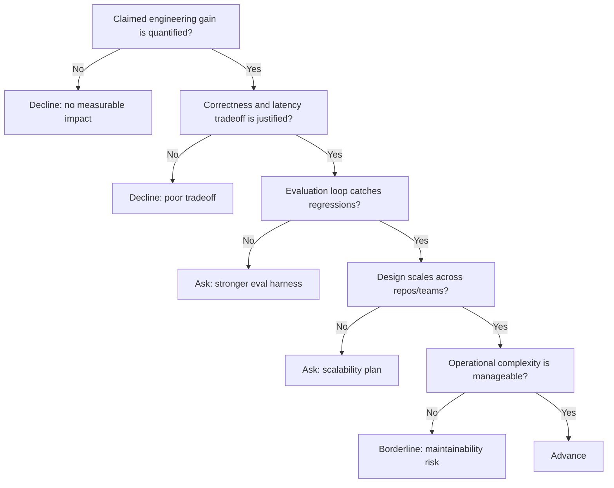

---
tags:
  - hackathon-judge
  - first-round
  - needs-verification
judge_round: first_round
last_researched: '2026-02-05'
research_confidence: medium
identity_risk: medium
last_verified: '2026-02-05'
verification_basis: public-signals-only
robustness_status: medium
---
# Daniel Steigman

## Verified Public Signals (as of February 5, 2026)
- Public profile signals consistently tie Daniel Steigman to OpenAI Codex and prior Cline work.
- A Cline author page supports direct association with Cline engineering content.
- Reporting around OpenAI's Cline talent integration indicates Daniel moved into OpenAI Codex work.

## Inferred Judging Priorities
Inference from available signals:
- Measurable developer productivity gains from coding agents.
- Practical engineering quality (correctness, latency, operational ergonomics).
- Strong implementation discipline over broad conceptual claims.

## What To Emphasize In Your Pitch
- Concrete before/after engineering metrics from your workflow.
- How your system balances speed with correctness under real repo constraints.
- Evaluation cadence: what you test, when you test, and how regressions are caught.

## What To Avoid
- Claims without measurement baselines.
- Architecture complexity that does not improve outcomes.
- No explanation of model/tool failures and fallback behavior.

## Likely Questions To Prepare For
- "Where are the measurable gains for engineers?"
- "How do you trade off latency versus quality?"
- "What controls prevent incorrect code from shipping?"

## Source Links
- https://luma.com/u/danielsteigman
- https://ghost.cline.bot/author/daniel/
- https://www.theinformation.com/briefings/openai-hires-7-cline-employees-codex-team

## Confidence + Identity Risk
Medium confidence, medium identity risk. Signals are directionally consistent but still limited in first-party OpenAI biographical detail.

## Decision Tree (Mermaid)

