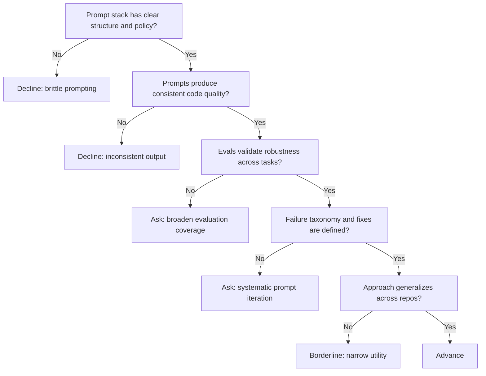

---
tags:
  - hackathon-judge
  - first-round
judge_round: first_round
last_researched: '2026-02-05'
last_verified: '2026-02-05'
verification_basis: cited-public-sources
research_confidence: high
identity_risk: low
---
# Dave Leo

## Verified Facts (Cited)
- OpenAI Cookbook's GPT-5-Codex Prompting Guide is authored by Dave Leo and is focused on robust prompting systems for coding tasks. [S1]
- OpenAI's Codex product materials emphasize reliability, verifiable execution, and quality guardrails in coding-agent workflows. [S2]

## Inferred Judging Lens (Inference)
- Likely to prioritize prompt/harness quality, consistency, and evaluation discipline. [S1]
- Likely to value evidence-driven reliability rather than one-shot prompting claims. [S1][S2]

## Pitch Guidance
- Present your prompt system as a governed stack (instructions, constraints, tool policy, verification).
- Show failure taxonomy and remediation process.
- Include comparative outcomes against simpler baselines.

## Sources (Resolved 2026-02-05)
- [S1] https://cookbook.openai.com/examples/gpt-5-codex_prompting_guide
- [S2] https://openai.com/index/introducing-codex/

## Confidence
High for prompting-domain relevance. Evidence is first-party and directly technical.

## Decision Tree (Mermaid)

