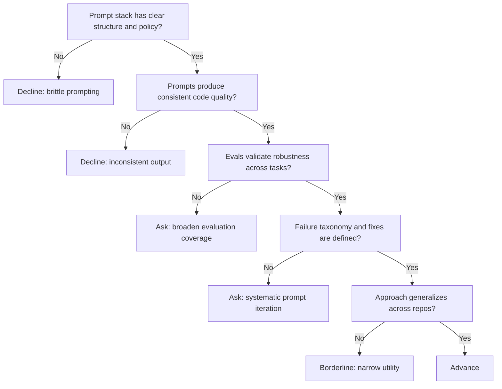

---
tags:
  - hackathon-judge
  - first-round
judge_round: first_round
last_researched: '2026-02-05'
research_confidence: high
identity_risk: low
last_verified: '2026-02-05'
verification_basis: public-signals-only
---
# Dave Leo

## Verified Public Signals (as of February 5, 2026)
- First-party OpenAI Cookbook article on GPT-5-Codex prompting is bylined to Dave Leo.
- Public event listings identify Dave Leo as OpenAI and tie him to coding-agent hackathon programming.
- The public content focus is practical prompting systems for coding reliability.

## Inferred Judging Priorities
Inference from published material:
- Prompt discipline and harness design quality.
- Reliability under real constraints rather than isolated one-off prompts.
- Evaluation-driven prompt iteration with clear acceptance criteria.

## What To Emphasize In Your Pitch
- Your prompt stack as a system: instructions, constraints, tool policy, verification.
- Prompt failure taxonomy and how you remediate each class.
- Evidence that your prompting approach generalizes across tasks/repos.

## What To Avoid
- Treating prompts as static magic strings.
- Ignoring tool permissions and execution boundaries.
- No empirical comparison against simpler baselines.

## Likely Questions To Prepare For
- "How robust is this prompt strategy across different codebases?"
- "How do you detect and fix prompt drift?"
- "What guardrails keep generated changes safe?"

## Source Links
- https://cookbook.openai.com/examples/gpt-5-codex_prompting_guide
- https://lu.ma/w5oh2vzg

## Confidence + Identity Risk
High confidence, low identity risk for judging-relevant expertise based on first-party byline plus event corroboration.

## Decision Tree (Mermaid)

