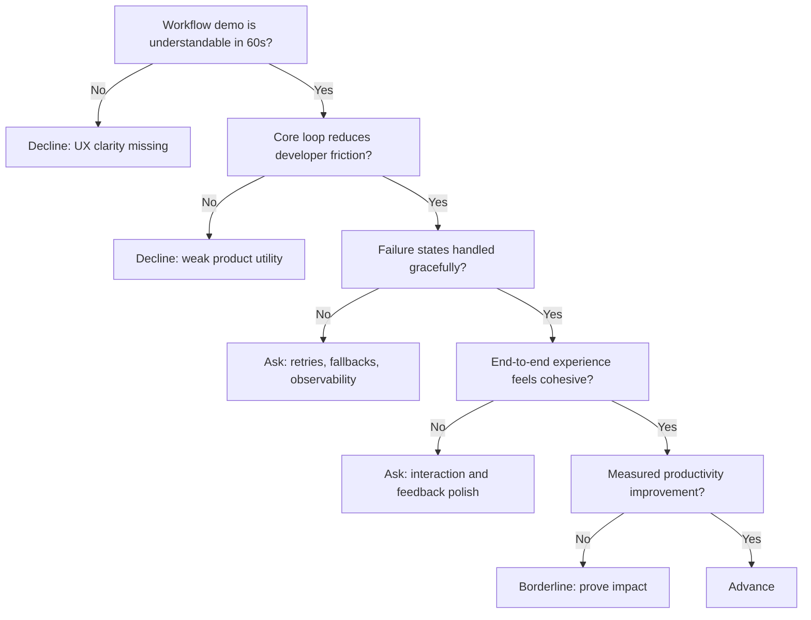

---
tags:
  - hackathon-judge
  - first-round
judge_round: first_round
last_researched: '2026-02-05'
last_verified: '2026-02-05'
verification_basis: cited-public-sources
research_confidence: high
identity_risk: low
---
# Ed Bayes

## Verified Facts (Cited)
- Ed Bayes' personal site states he is currently Member of Design Staff at OpenAI, working on coding agents in the research team. [S1]
- Software Engineering Daily's OpenAI/Codex episode identifies Ed Bayes as Codex product designer alongside Thibault Sottiaux. [S2]

## Inferred Judging Lens (Inference)
- Likely to prioritize product/design quality in real agent workflows, not just raw model output. [S1][S2]
- Likely to value UX clarity, flow efficiency, and practical developer outcomes. [S1]

## Pitch Guidance
- Demo one polished end-to-end loop with visible error recovery.
- Make user feedback/observability and iteration speed explicit.
- Quantify productivity changes where possible.

## Sources (Resolved 2026-02-05)
- [S1] https://www.edbayes.com/
- [S2] https://softwareengineeringdaily.com/2026/01/29/openai-and-codex-with-thibault-sottiaux-and-ed-bayes/

## Confidence
High. Public role information is direct and consistent across sources.

## Decision Tree (Mermaid)

