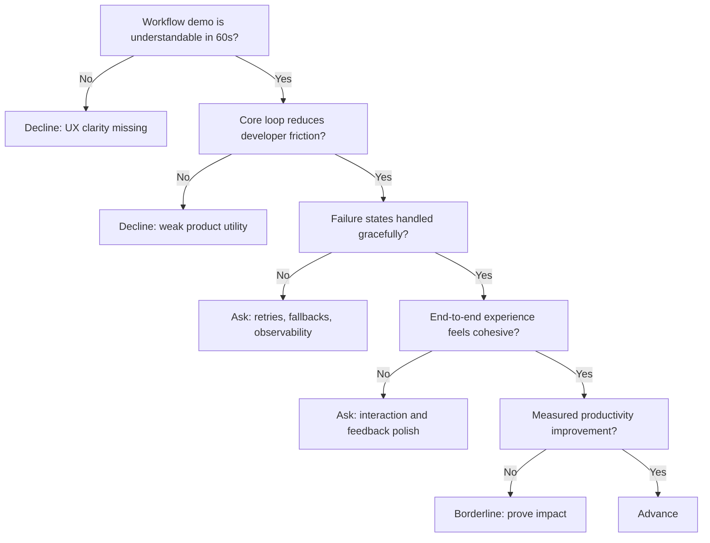

---
tags:
  - hackathon-judge
  - first-round
judge_round: first_round
last_researched: '2026-02-05'
research_confidence: high
last_verified: '2026-02-05'
verification_basis: public-signals-only
---
# Ed Bayes

## Snapshot
- Current role: Member of Design Staff at OpenAI (research team) focused on coding agents and product/design interfaces.
- Background highlights: design/technology work across frontier AI, prior robotics work at Google X, founder of General Purpose studio, educator.
- Public positioning: active public voice for Codex and developer UX.

## Judging Lens (Likely)
- Product design quality in agentic workflows.
- Developer UX clarity: setup friction, feedback loops, and iteration speed.
- Whether a team can translate model capability into usable product behavior.

## Practical Pitch Strategy
- Show one polished end-to-end workflow, not just model output demos.
- Make quality-of-life UX details obvious (retries, observability, failure handling).
- Quantify productivity gains with before/after developer metrics.

## Source Links
- https://www.edbayes.com/
- https://www.linkedin.com/posts/edbayes_a-few-months-late-but-delighted-to-share-activity-7283555391345418241-3yxj
- https://cookbook.openai.com/examples/codex/codex_mcp_agents_sdk/building_consistent_workflows_codex_cli_agents_sdk

## Confidence
High (strong first-party profile and recent OpenAI/Codex references).

## Decision Tree (Mermaid)

