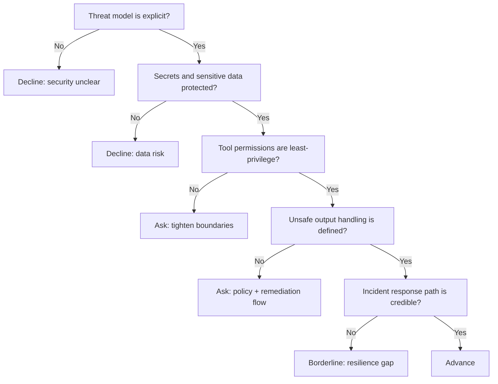

---
tags:
  - hackathon-judge
  - first-round
judge_round: first_round
last_researched: '2026-02-05'
research_confidence: high
last_verified: '2026-02-05'
verification_basis: public-signals-only
---
# Fouad Matin

## Snapshot
- Current role: Works on security at OpenAI.
- Prior background: Co-founder/CEO at Indent; previous engineering roles including Segment; product-design + engineering blend.
- Public focus: Codex, security, and agent-enabled secure development workflows.

## Judging Lens (Likely)
- Security posture of AI applications and agent workflows.
- How teams manage sensitive data, sandboxing, and permission boundaries.
- Practical vulnerability discovery/remediation workflow design.

## Practical Pitch Strategy
- Clearly document your threat model and mitigation approach.
- Show how you constrain tool use, protect secrets, and handle unsafe outputs.
- Include one concrete security incident simulation and your response path.

## Source Links
- https://fouad.org/
- https://fouad.org/about
- https://twstalker.com/fouadmatin

## Confidence
High (first-party site with explicit role timeline, corroborated by public activity).

## Decision Tree (Mermaid)

