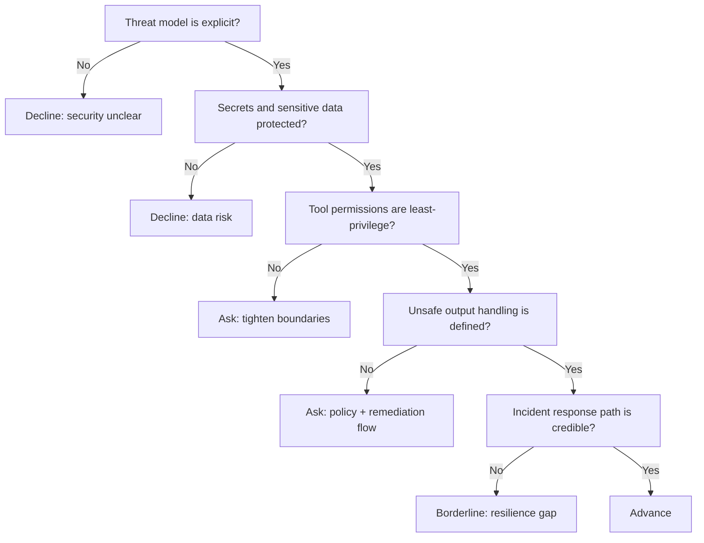

---
tags:
  - hackathon-judge
  - first-round
judge_round: first_round
last_researched: '2026-02-05'
last_verified: '2026-02-05'
verification_basis: cited-public-sources
research_confidence: high
identity_risk: low
---
# Fouad Matin

## Verified Facts (Cited)
- Fouad Matin's site states he works on security at OpenAI. [S1]
- His about page lists role timeline including OpenAI Security (May 2024–present), prior Co-founder/CEO at Indent, and prior Segment engineering role. [S2]

## Inferred Judging Lens (Inference)
- Likely to prioritize concrete security controls in agent systems (permissions, data handling, boundaries). [S1][S2]
- Likely to value realistic threat modeling and incident response readiness. [S2]

## Pitch Guidance
- Present explicit threat model + mitigations.
- Show least-privilege tooling and secret/data handling controls.
- Include one incident simulation and containment/recovery path.

## Sources (Resolved 2026-02-05)
- [S1] https://fouad.org/
- [S2] https://fouad.org/about

## Confidence
High. Primary first-party role timeline and scope are explicit.

## Decision Tree (Mermaid)

