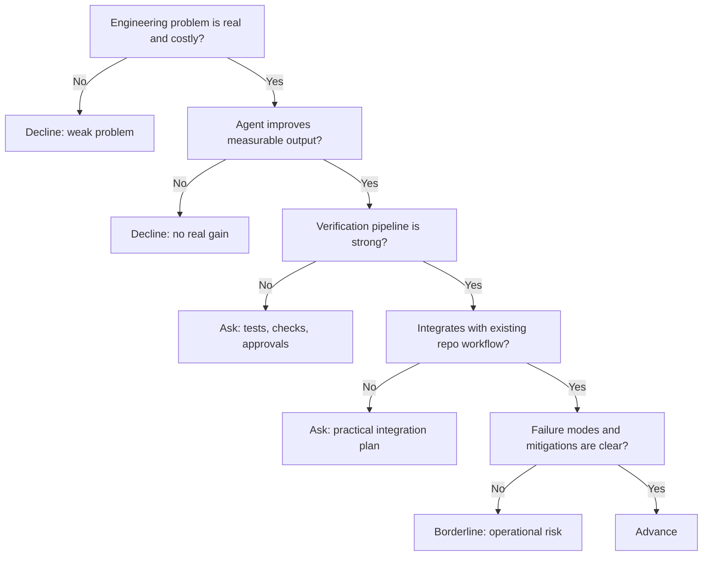

---
tags:
  - hackathon-judge
  - first-round
  - needs-verification
judge_round: first_round
last_researched: '2026-02-05'
research_confidence: medium
identity_risk: high
last_verified: '2026-02-05'
verification_basis: public-signals-only
robustness_status: medium
---
# Francis Greenleaf

## Verified Public Signals (as of February 5, 2026)
- Public social profile traces for `@inferencetoken` identify Francis Greenleaf as Codex-related at OpenAI with prior Cline/Ellipsis references.
- Independent social posts from Codex-adjacent accounts corroborate Francis joining OpenAI Codex.
- Third-party profile aggregation aligns prior background with Cline and Ellipsis Health.

## Inferred Judging Priorities
Inference from available signals:
- Engineering usefulness of coding agents in real software workflows.
- Practical outcome orientation (fewer manual loops, faster shipping, higher correctness).
- Preference for systems that move beyond demo quality into operational reliability.

## What To Emphasize In Your Pitch
- Measurable engineering outcomes: review speed, defect reduction, deployment throughput.
- Guardrails and verification: tests, static checks, permission boundaries, rollback paths.
- Practical integration into existing workflows (repo, CI, issue tracking, code review).

## What To Avoid
- Hand-wavy "AI magic" claims without evaluation evidence.
- Noisy multi-agent architecture without clear ownership and traceability.
- Unbounded autonomy with weak human approval gates.

## Likely Questions To Prepare For
- "What evidence shows this improves real engineering output?"
- "How do you evaluate quality and regressions over time?"
- "What are your most common failure modes and mitigations?"

## Source Links
- https://ngntipkolamrenang.twstalker.com/inferencetoken
- https://twstalker.com/nickbaumann_
- https://twstalker.com/ahmedali8x
- https://contactout.com/francis-greenleaf-31741

## Confidence + Identity Risk
Medium confidence, high identity risk. Cross-source consistency exists, but first-party biography coverage remains sparse.

## Decision Tree (Mermaid)

