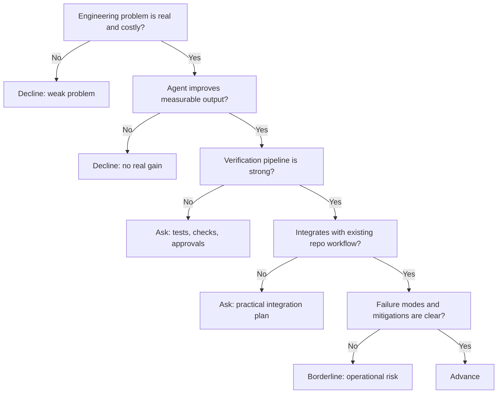

---
tags:
  - hackathon-judge
  - first-round
  - needs-verification
judge_round: first_round
last_researched: '2026-02-05'
last_verified: '2026-02-05'
verification_basis: cited-public-sources
research_confidence: medium
identity_risk: high
---
# Francis Greenleaf

## Verified Facts (Cited)
- Public profile aggregation still maps Francis Greenleaf to a Cline operations role and prior Ellipsis Health role. [S1]
- Public social-profile mirrors claim "Codex @openai" with prior Cline/Ellipsis attribution. [S2]
- Reporting from The Information confirms OpenAI hired multiple staffers from Cline for Codex, though full official per-person confirmation is limited publicly. [S3]

## Inferred Judging Lens (Inference)
- Likely to value practical operational impact, measurable engineering outcomes, and workflow reliability. [S1][S3]
- Likely to scrutinize execution discipline over broad AI claims. [S1]

## Pitch Guidance
- Bring measurable gains (cycle time, defects, review speed).
- Show guardrails: tests, approvals, rollback, and ownership boundaries.
- Keep architecture claims proportional to validated outcomes.

## Sources (Resolved 2026-02-05)
- [S1] https://contactout.com/francis-greenleaf-31741
- [S2] https://ngntipkolamrenang.twstalker.com/inferencetoken
- [S3] https://www.theinformation.com/articles/openai-hires-least-seven-staffers-coding-startup-cline

## Confidence
Medium with high identity risk. Public signals are consistent but heavily depend on third-party/aggregated profiles rather than first-party biography.

## Decision Tree (Mermaid)

