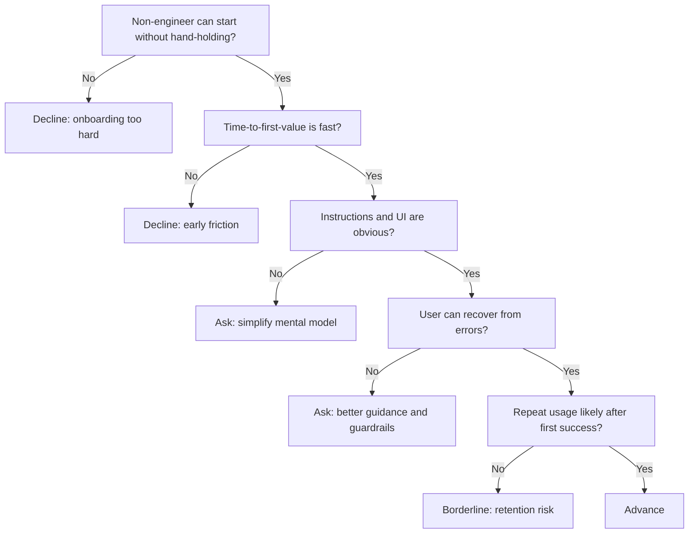

---
tags:
  - hackathon-judge
  - first-round
  - needs-verification
judge_round: first_round
last_researched: '2026-02-05'
last_verified: '2026-02-05'
verification_basis: cited-public-sources
research_confidence: medium
identity_risk: medium
---
# Hannah Koch

## Verified Facts (Cited)
- Hannah Koch's LinkedIn post states she is proud to work with the team behind the Codex app and describes building a working iOS app with Codex as a non-engineer. [S1]
- OpenAI's official Codex app announcement confirms launch scope, product positioning, and broad usability claims. [S2]

## Inferred Judging Lens (Inference)
- Likely to prioritize non-engineer accessibility, onboarding speed, and practical usability. [S1][S2]
- Likely to value clear human-agent handoff and recoverability in workflows. [S1]

## Pitch Guidance
- Show first-run success path for non-experts.
- Make error recovery explicit and low-friction.
- Demonstrate repeat usage behaviors beyond one successful run.

## Sources (Resolved 2026-02-05)
- [S1] https://www.linkedin.com/posts/hannah-koch-a4489457_introducing-the-codex-app-activity-7424186246781915136-6aoG
- [S2] https://openai.com/index/introducing-the-codex-app/

## Confidence
Medium. Signal is strong but relies on social post + limited long-form first-party biography detail.

## Decision Tree (Mermaid)

