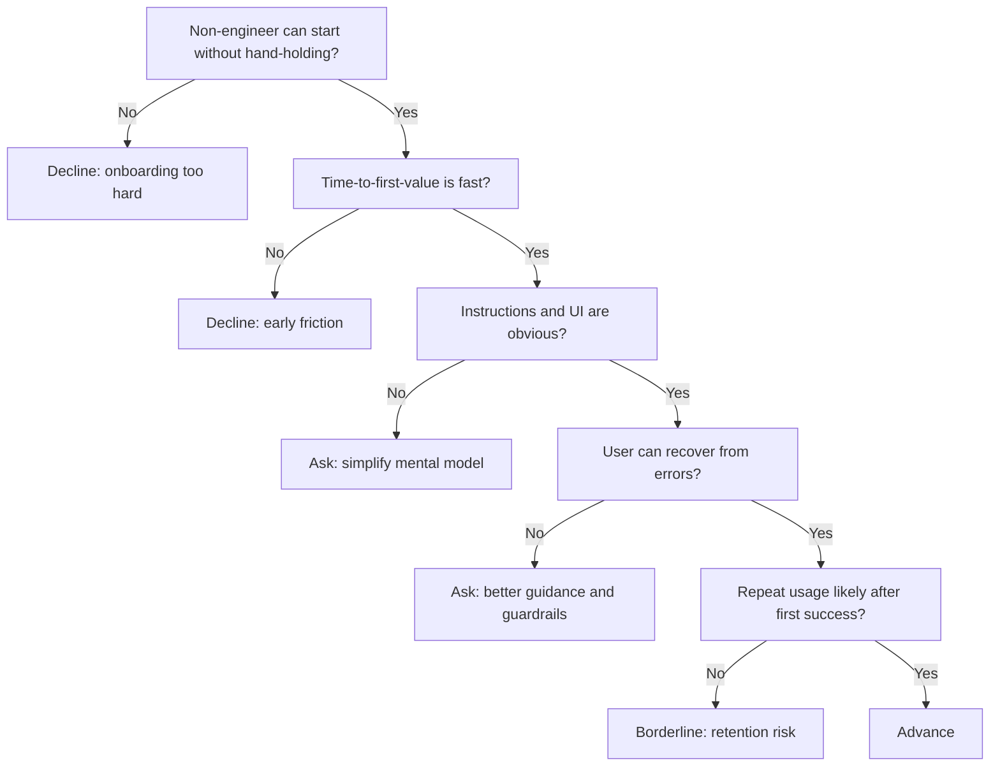

---
tags:
  - hackathon-judge
  - first-round
  - needs-verification
judge_round: first_round
last_researched: '2026-02-05'
research_confidence: medium
identity_risk: medium
last_verified: '2026-02-05'
verification_basis: public-signals-only
robustness_status: medium
---
# Hannah Koch

## Verified Public Signals (as of February 5, 2026)
- A public LinkedIn post by Hannah Koch states she works with the team behind the Codex app.
- The same post describes a non-engineer to builder workflow (shipping an iOS app quickly with Codex).
- The post aligns with OpenAI's official Codex app launch materials.

## Inferred Judging Priorities
Inference from the signals above:
- Product accessibility for non-engineers and cross-functional teams.
- Fast time-to-value and onboarding clarity.
- UX quality of agent workflows, not just model raw capability.

## What To Emphasize In Your Pitch
- A clean user journey from zero setup to first successful output.
- How non-expert users can operate the workflow safely and repeatably.
- Real usability proof (task completion rate, user time saved, drop-off points fixed).

## What To Avoid
- Overly technical architecture deep dives in the first minute.
- Demo paths that only work for expert developers.
- Unclear handoff between human and agent responsibilities.

## Likely Questions To Prepare For
- "How quickly can a non-engineer get value from this?"
- "Where does the product fail, and how does the user recover?"
- "What did users do repeatedly after the first successful run?"

## Source Links
- https://www.linkedin.com/posts/hannah-koch-a4489457_introducing-the-codex-app-activity-7424186246781915136-6aoG
- https://openai.com/index/introducing-the-codex-app/

## Confidence + Identity Risk
Medium confidence, medium identity risk. Public signal is strong for Codex involvement, but publicly available long-form biography detail is still limited.

## Decision Tree (Mermaid)

