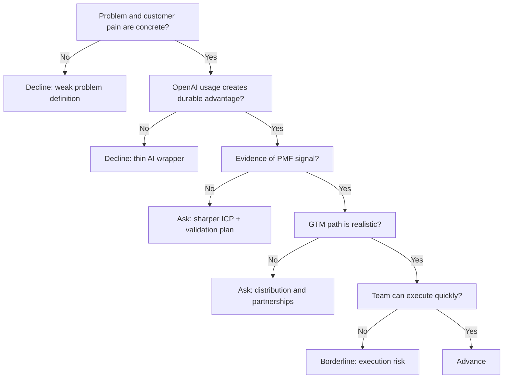

---
tags:
  - hackathon-judge
  - first-round
judge_round: first_round
last_researched: '2026-02-05'
last_verified: '2026-02-05'
verification_basis: cited-public-sources
research_confidence: high
identity_risk: low
---
# Laura Modiano

## Verified Facts (Cited)
- Panathenea speaker profile identifies Laura Modiano as "Startups EMEA" at OpenAI and details prior AWS/VC ecosystem background. [S1]
- Slush program profile similarly identifies her as OpenAI Startups Lead EMEA. [S2]
- Tech.eu interview coverage quotes her in role discussing OpenAI startup engagement in Europe. [S3]

## Inferred Judging Lens (Inference)
- Likely to prioritize startup execution: PMF signal, GTM realism, and scaling readiness. [S1][S2][S3]
- Likely to assess whether teams show durable advantage beyond a thin model wrapper. [S3]

## Pitch Guidance
- Lead with customer pain + measurable impact.
- Show distribution path and expansion logic, not just demo quality.
- Clarify why your team has a durable right-to-win.

## Sources (Resolved 2026-02-05)
- [S1] https://www.panathenea.org/panathenea-2025/speakers/laura-modiano/
- [S2] https://slush.org/program/laura-modiano
- [S3] https://tech.eu/2025/06/25/some-of-the-best-ai-solutions-are-coming-from-europe-says-openai-emeas-head-of-startups/

## Confidence
High. Multiple independent role references are consistent.

## Decision Tree (Mermaid)

