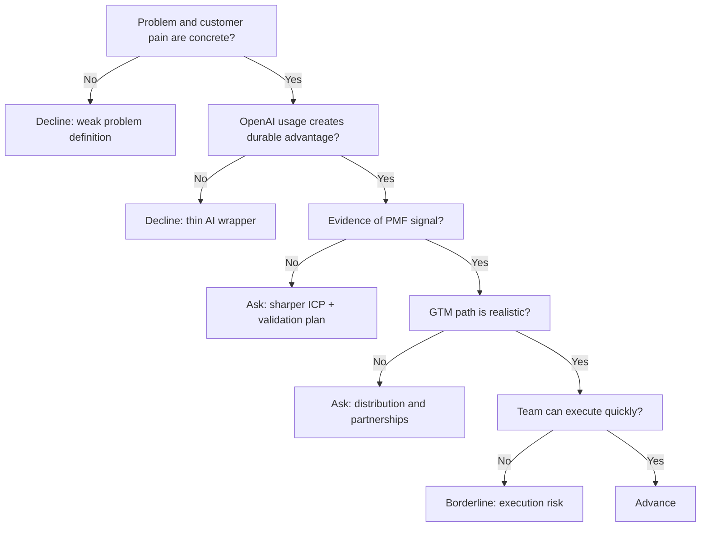

---
tags:
  - hackathon-judge
  - first-round
judge_round: first_round
last_researched: '2026-02-05'
research_confidence: high
last_verified: '2026-02-05'
verification_basis: public-signals-only
---
# Laura Modiano

## Snapshot
- Current role: Startups EMEA lead/head at OpenAI.
- Focus area: Startup ecosystem development across EMEA (VCs, accelerators, startup teams, developer community).
- Prior background: AWS startup/VC partnerships, healthcare/life sciences startup programs, consulting and health/data/AI partnership roles.

## Relevant Context For Judging
Laura appears to sit at the intersection of frontier AI capability and startup execution in EMEA. She is likely strong on:
- Product-market fit signals in early AI startups.
- GTM realism, partnership leverage, and founder velocity.
- Founder quality, ecosystem strategy, and scaling readiness.

## Practical Pitch Strategy
- Lead with the business problem and measurable user impact first.
- Show how your team uses OpenAI models as a moat, not as a thin wrapper.
- Be specific about distribution and expansion strategy (who buys, why now, and why you).

## Source Links
- https://summit.sifted.eu/speakers/laura-modiano
- https://www.panathenea.org/panathenea-2025/speakers/laura-modiano/
- https://www.linkedin.com/posts/laura-modiano_solutions-architect-startups-openai-activity-7288163683510140928-bp-R

## Confidence
High (multiple public sources consistently identify her OpenAI startups role).

## Decision Tree (Mermaid)

